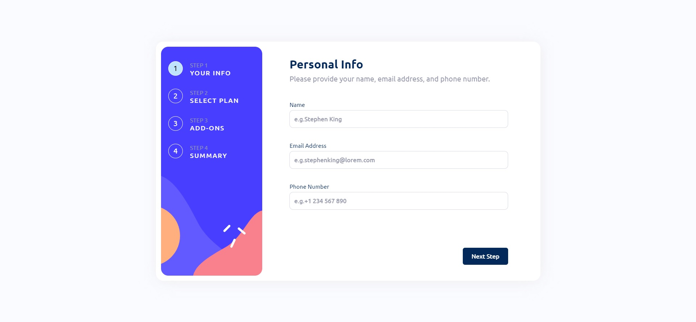

# Frontend Mentor - Multi-step form solution

This is a solution to the [Multi-step form challenge on Frontend Mentor](https://www.frontendmentor.io/challenges/multistep-form-YVAnSdqQBJ). Frontend Mentor challenges help you improve your coding skills by building realistic projects. 

## Table of contents

- [Overview](#overview)
  - [The challenge](#the-challenge)
  - [Screenshot](#screenshot)
  - [Links](#links)
- [My process](#my-process)
  - [Built with](#built-with)
  - [What I learned](#what-i-learned)
  - [Continued development](#continued-development)
- [Author](#author)

## Overview

### The challenge

Users should be able to:

- Complete each step of the sequence
- See a summary of their selections on the final step and confirm their order
- View the optimal layout for the interface depending on their device's screen size
- See hover and focus states for all interactive elements on the page

### Screenshot

### Links

- Solution URL: [Add solution URL here](https://your-solution-url.com)
- Live Site URL: [Add live site URL here](https://your-live-site-url.com)

## My process

### Built with

- Semantic HTML5 markup
- CSS custom properties
- Flexbox
- JavaScript Vanilla

### What I learned

This project helped me to:
- Learn the basics about validating forms and inputs in form inputs.
- Save the prices, in this case of the plans, to later show them depending on whether the plan is annual or monthly.
- A little more CSS layout.

### Continued development

I think that my weakness is still CSS... Mostly because I did a couple of tricks which I'm aware are not good language practices, but I'm practicing to learn how to layout correctly.

## Author

- Website - [Mauro Centurion](https://github.com/maurocentu26)
- Frontend Mentor - [@yourusername](https://www.frontendmentor.io/profile/maurocentu26)
